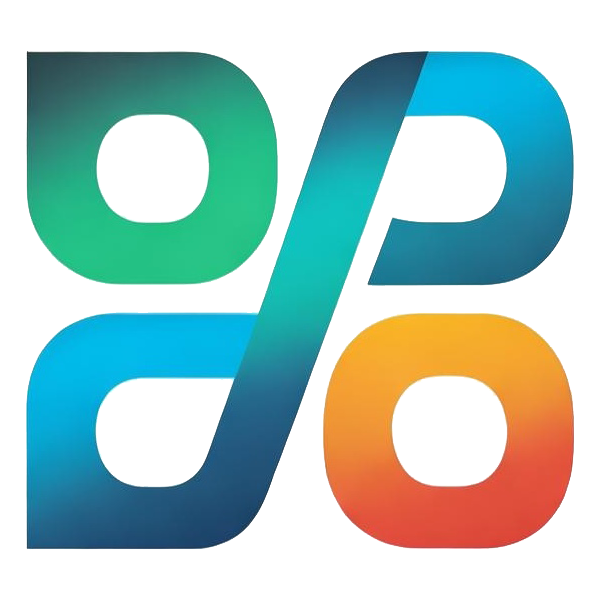

# basic information 

Project name:   Super Fair Governance

Project approval date (month and year): November 2024 

# Project Details

## Background

Voting governance is the most widely used collective decision-making method, but there are four pain points in voting governance decision-making:
1: Governance attack issues;
2: The problem of majority tyranny;
3: Infringement of the rights and interests of minority opinion holders;
4: Addressing the issue of apathy; 

## Logo

## Project overall introduction
The super fair governance chain is an L1 chain based on decentralized decision making, where all applications in the chain meet the requirements of decentralized decision-making: Decentralized decision-making technique is a different concept from decentralized execution. It is a result-oriented decision-making method that aims to satisfy the personal preferences of all participants.

The theory of decentralized decision  making has its origins in the cake-cutting problem (typical cake-cutting solutions are envy-free division and super fair distribution, two decentralized decision-making techniques based on the principle of unanimous consent, which aim to make everyone believe that their cake is bigger than that of others or that their cake is bigger than that of the average).

Developers can develop various applications based on the superfair governance chain, e.g. superfair distribution, superfair negotiation, superfair price guarantee, etc. The super fair governance chain provides governance computing, fairness verification, historical data query, and other services for various applications.

# Features planned for the Hackathon

## The application of super fair distribution
In some DAOs, digital collections or NFTs are co-created by the community, and some sharing relationships for member projects are clear. Before the NFT is publicly realized, members may want to distribute the NFT. At this time, since the NFT belongs to Indivisible projects and all members may have inconsistent valuations of the NFT, and their opinions on whether to sell the NFT are often not unified. Therefore, a universal and fair processing procedure is required.

## The application of super fair negotiation
In some communities, it often happens that different solutions to a problem may bring benefits to some people, while also harming the rights and interests of others. At this time, we need to find a collective decision through negotiation that satisfies all parties.

## Architect

mermaid
graph TD
A [User] -->B [Voting Interface]
B -->C {Submit Voting}
C -->| Use Bit Promise | D [Bit Promise Pallet]
D -->E [Blockchain]
E -->F [Voting Data Storage]
F -->G {Voting Decision Algorithm}
G -->H [Decision result]
H -->I [Decision Result Query Interface]
I --> A
E -->J {Decentralized Validation}
J -->K [Decentralization Level Report]
K --> A
 

###  Component Description of Framework Diagram

#### User
-Participants in the voting governance system can submit votes and query voting results.

#### Voting Interface
-User interface for submitting votes and viewing voting results.

#### Submission of Voting
-Users submit their votes through the voting interface, and the voting data is encrypted using a bit commitment pallet.

#### Bit Promise Pallet
-Implement a bit commitment mechanism for encrypting voting data to ensure privacy and security.

#### Blockchain
-A distributed ledger that stores all transaction and voting data.

#### Voting Data Storage
-Store user submitted voting data to ensure its immutability and traceability.

#### Voting Decision Algorithm
-Calculate the voting results based on the stored voting data.

#### Decision Results
-The output of the voting decision algorithm.

#### Decision result query interface
-Provide an interface for users to query real-time or historical voting results.

#### Decentralized Verification
-Verify the decentralization level of voting results to ensure the fairness and transparency of the voting process.

#### Decentralization Level Report
-Provide a report on the degree of decentralization of voting results for users and system administrators to refer to.

### instructions
1. Users submit their votes through the voting interface and encrypt the voting data using BitPromise Pallet.
2. Voting data is stored on the blockchain.
3. The voting decision algorithm calculates the results based on the stored voting data.
4. Users can query the voting results through the decision result query interface.
5. The system evaluates the degree of decentralization of voting results through a decentralized verification module and generates a report.

 
## Schedule

Done during hackathon: 

Runtime:  

Web frontend: call extrinsics and querys.

## Team info 

| Name        | Role                   |
| ----------- | ---------------------- |
| liuCDao     | Project & Contract     |
| Sam         | Frontend               |
 

#  Bountiy want to apply  
 - ## [Category 3: (Chain )] - Building a blockchain based on Polkadot SDK.
    Build a custom blockchain challenge using Substrate.
 - ## [Blockchain for good] - Reducing Inequality  
    Social Welfare Distribution: Use blockchain technology to ensure the transparent and efficient distribution of social welfare funds, reducing corruption and waste in intermediary processes. 

# Material for Demo
1. Demo Video [link to Youtube]
2. PPT [link to google doc]

