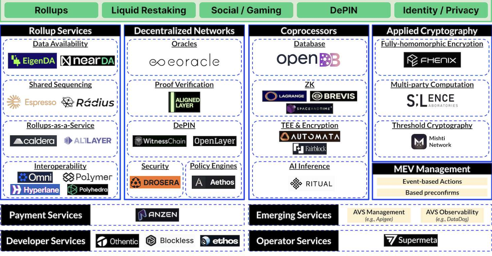

# Project zkLogin
## Introduction

Cyferio hub is a decentralized cryptographic collaborative caching layer based on Substrate. It is dedicated to building a modular network stack based on critical infrastructure to enhance the experience of billions of users in the future and promote the ultimate realization of a decentralized Internet.

At the same time, Cyferio Hub provides an AVS ecosystem for the AVS consumer bearer server-side framework TMC (Trustless Modular Calculator) to help the project provide end-to-end capabilities to enhance and expand the realization. Based on this, no matter which tier of Vertical Saas the project is in, it can connect to Cyferio Hub as a caching relay tier to provide a better user experience.

TMC is a modular co-processor and rollup stack enabling verifiable Fully Homomorphic Encryption (FHE). It unlocks privacy-preserving, massively parallel execution of computations for both Web2 and Web3 applications.

By leveraging FHE, advanced modular Rollup designs, and parallelism in computational proofs within a trustless computing layer, TMC enables secure, near-real-time computations on public and private on-chain states while preserving composability and interoperability.

Float Cache DB: Based on DragonflyDB's fastest modern architectural cache database and JMT(**Jellyfish Merkle Tree) from Diem** implementation.With our self-developed Float Cache DB, we have unlocked powerful distributed caching capabilities into Cyferio's technology stack to bring huge improvements to the network load and user experience.

## Features planned for the Hackathon

- [ ] Tmc Integration with Cache Layer:When the tmc node receives a transaction request from the user, tmc will be the first to send the transaction to the execution module for processing, and at the same time, it will send the data related to this transaction to the cyferio cache layer for backup.
- [ ] Cache Message queue Pallet : The cache information module of Cyferio hub will accept the cache blob data sent from Tmc nodes and queue it up, waiting for the down-chain worker to extract the cache information.
- [ ] Off chain work integration with T Tmc relay message cluster: Whenever an off-chain worker waits until the next block is generated, it will fetch the cache information from the cache module to send the data to the data publishing layer or availability layer, or other service layer and waits for the result to be written into the next produced block data.
- [ ] tmc relay message cluster Integration walrus storage
- [ ] Web page:One website example for full process demonstration

## Architect

## Schedule
—TimeLine for hachathon 

:We only had 7 days between signing up for the contest and completing the code.

So we decided to finish an MVP version . Covers

(1) Features planned

(2) Video

(3) PPT

## Team info
| name         | role         | GitHub |
| ----------- | ----------- | -----------  |
| Moven  | ZK & FHE Cryptography  | https://github.com/moven0831   
| Henry       | Tmc Engineer   |   https://github.com/Zombieliu     |
| Frenk  | BlockChain  | https://github.com/vladilen11   
| bob       | BlockChain   |   https://github.com/web3olalala     |

## Material for Demo
1. Docs
2. Demo Video [link to Youtube]
3. PPT [link to google doc]

