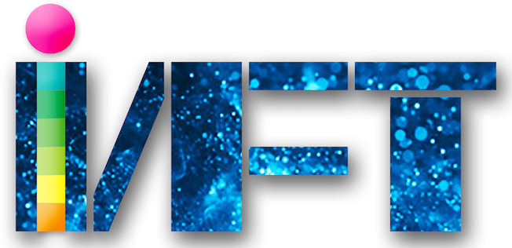
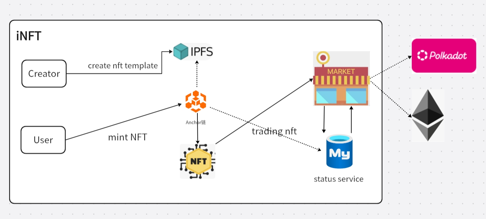

## basic information
Project name: iNFT
Project approval date (month and year): July 2024 

## Project overall introduction

#### Logo

#### Introduction

The iNFT project is a universal NFT hair tool designed for artists, collectors and investors. By providing a simple and portable template function, artists, collectors and investors can quickly access and sell works, support multiple cryptocurrency transactions, and meet the needs of different users.

- A new method to cast NFTs through block hashes on the chain and template files that cannot be modified.
- The design of the template can make iNFT recognizable.
- Each blockchain network has a random block hash, and iNFT can be deployed on multiple chains and support multiple networks.
- Dapp can balance the value between different networks through mathematical scarcity.

## Features planned for the Hackathon
Portal
- Latest mint result.

Market：
- Selling list.
- Selling list filter.
- iNFT selling detail.

Bounty
- New bounty submission.
- Bounty list via API.
- Bounty result apply.

Playground
- Load template from web3.storage
- Template hash mocker
- Template parts detail
- Template series detail
- Template raw data preview

API
- iNFT category list by address.
- iNFT category list by template.
- iNFT category list by block.
- Bounty list.
- Bounty submission.

Manage Portal
- iNFT fav management.

Minter
- New UI of mint
- Minting board
- Template preview
- iNFT management

Editor
- Write template to IPFS via polkadot.js

Pallet iNFT
- Anchor divert.
- Anchro drop.
- Update to latest version of Polkadot SDK ( Substrate ).

## Architect
- Market system.

- Bounty merchant workflow.

- Bounty user workflow.

## Schedule

### Multi Chain Operation
- Support multi chain airdrop by iNFT way, merchant can publish airdrop bounty on Anchor Network which is base on Substrate.
- All actions are recorded on Anchor Network where the iNFT is minted on.

### Multi Chain Asset
- Using the BTC block hash as the target for iNFT, and the iNFT on Anchor Network can be transfer to Etherum Network by Last Words method. When the iNFT on Anchor Network is dropped, the Last Words is written on chain, it can be used to approve the iNFT and create one on Etherum Network.
- Bridge ERC-20 token between Anchor Netwok and Etherum Network. By this way, Anchor Network can be restart frequently to keep it simple.
- The history data of Anchor Network with the Etherum salt can be store on IPFS, and the Merkel root on Etherum Network. Even the Anchor Network is crushed down, the asset can still be approved.

### Dapps
#### Editor
- Function, It is the tools for designer to set the parameters for iNFT. Only the source image needed, the iNFT parts can be added here.
- Language and Framework, React ( Javascript )
- Multi networks support, you can write the iNFT template on different blockchain network.
- Single iNFT file upload/download support.

#### Minter
- Function, The client Dapp for normal users.
- Language and Framework, React ( Javascript )
- Customer can explorer the templates, then mint on selected template.
- The list of result can be checked from minter.
- In some network, you can manage your account here.

#### Market
- Function, Selling market of iNFT result. Customers can price the NFT themselves.
- Language and Framework, React ( Javascript )
- Different networks supported.

#### Bounty
- Function, Bounty for airdrop base on iNFT, merchant can publish bounty iNFT.
- Language and Framework, React ( Javascript )
- Different networks supported. Full workflow on Anchor Network.

### Service
#### Faucet
- Function, User get airdrop from Anchor Network.
- Language and Framework, Node.js ( Javascript )
- User get airdrop from Anchor Network.

#### API
- Function, get the bounty and cached iNFTs on server.
- Language and Framework, PHP, Redis, MySQL
- Cooperating with Cache Robot to supply the iNFT data service.

#### Portal
- Function, managment portal for market and bounty.
- Language and Framework, PHP, Redis, MySQL
- Bounty management. Put bounty on line or off line. Check the applying. Saving the bonus payment on Anchor Network.

#### Cache Robot
- Function, cache iNFT records and group them.
- Language and Framework, Node.js ( Javascript )
- Group iNFTs by address.
- Group iNFTs by template.
- Record of iNFT history, including all actions (set, sell, buy, revoke, divert, drop)
- Subcribe Anchor Network to update the history of iNFT.

#### Minting Robot
- Function, mint iNFT by setting.
- Language and Framework, Node.js ( Javascript )
- Multi accounts support to mint iNFT.

## Team info

Fuu
- 5 years of development experience, proficient in Javascript, PHP and other development languages, 2 years of blockchain development experience. Won Grants from Web3 Foundation, and won the third place in Polkadot2023 as a team leader.
- Github: https://github.com/ff13dfly
- Email: ff13dfly@gmail.com

Huan
- Many years of experience in the design industry. Provide storyboards, graphic design, UI design and other visual content for clients. Participate in iNFT project design out of interest in this field.

Xu
- More than 10 years of project management experience, open source community enthusiast, organized several technical conferences with thousands of people, interested in blockchain and decentralization
- Github: https://github.com/xushizhao
- Email: xushizhao1983@gmail.com

## Material for Demo

1. [Demo Video ： iNFT_Polkadot_final_2024.mp4](https://drive.google.com/file/d/1l6CNc8hqmtyPV3O0xQxNYitBKkJNB67O/view?usp=sharing)
2. [PPT：iNFT_Polkadot_final_2024.pptx](https://docs.google.com/presentation/d/1VbfJavDgA2Jo3UHeINXkeGgIMpyxMgeu/edit?usp=sharing&ouid=103801114996040356653&rtpof=true&sd=true)
