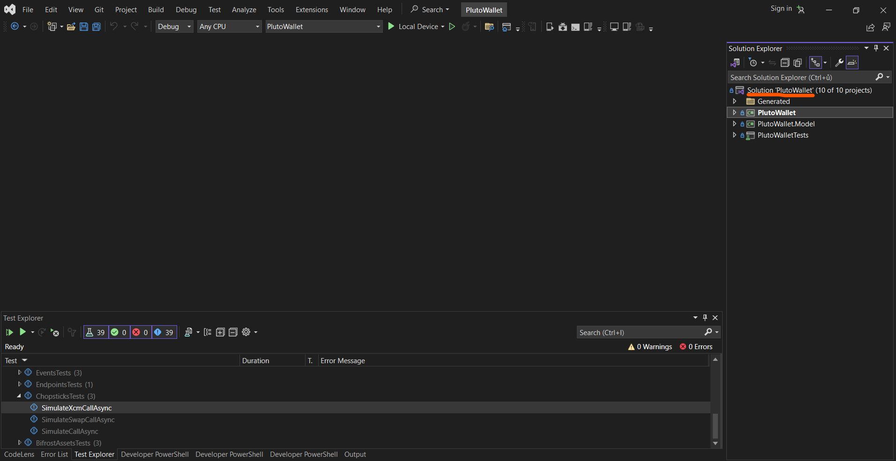
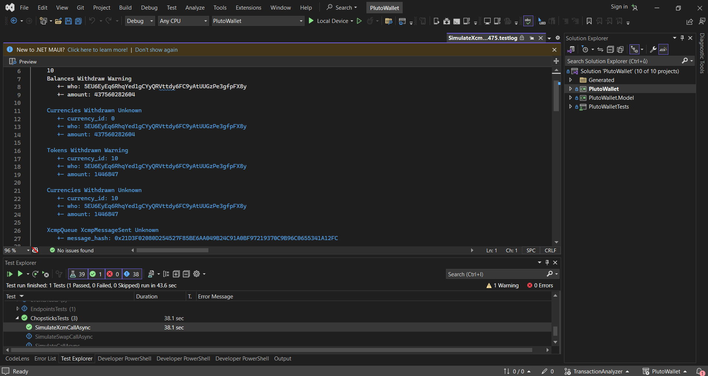
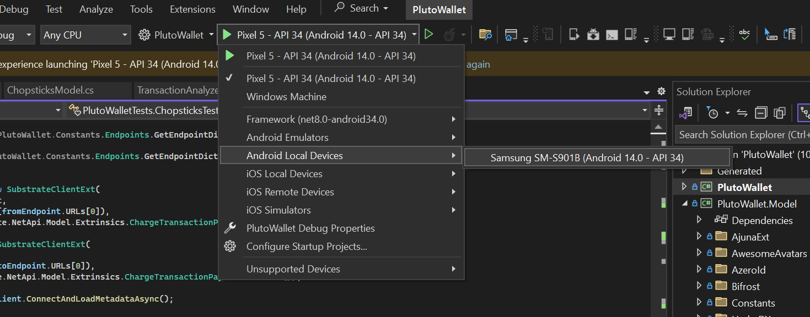

# Transaction Analyzer

Project name: Transaction Analyzer
Initial commit: 30th July
Team: Rostislav Litovkin, Jaromír Procházka


## Project background

- It is part of the existing PlutoWallet project: https://github.com/RostislavLitovkin/PlutoWallet/tree/TransactionAnalyzer
- Although we are currently asking for [OpenGov Treasury funding #1076](https://polkadot.polkassembly.io/referenda/1076), we did not ask for any money to fund the Transaction Analyzer project.

## Goal

Transaction Analyzer is an inteligent all-in-one tool for ensuring user safety.
1) forks the desired chain
2) simulates the extrinsic
3) analyses all events emmited by the extrinsic
4) shows the analysed info in simple to understand way to users. UX is improtant to us.

Without good UX, good safety is meaningless. Our goal is to achieve both!

## Problem to be solved

Enhance user security by providing an easy to understand UI/UX for each extrinsic. If the information is conveyed well to the user, then even the ones not knowledgeable about security can feel safe knowing that they will never get scammed.

## Overview

This project is an extension of [PlutoWallet](https://github.com/RostislavLitovkin/PlutoWallet/tree/TransactionAnalyzer) crypto wallet. It adds analysis of your transaction and a pop-up window of expected events before confirmation. It is used for making your transaction more secure and prevent possible errors.

## 6-min youtube presentation

https://youtu.be/8qTHWU_wOwU

## Project demonstration

= last 2 mins of the youtube video

## Presentation slides

https://www.canva.com/design/DAGOkIInTqE/AulQ8MNaoRHYkTiuLCQRfQ/edit?utm_content=DAGOkIInTqE&utm_campaign=designshare&utm_medium=link2&utm_source=sharebutton

## Architecture & how it works

There are two parts to Transaction Analyzer. The local **Client in C#** language and a **Webserver running Chopsticks**. The [Chopsticks](https://github.com/AcalaNetwork/chopsticks) tool developed by Acala is used to copy the Blockchain code, simulate the transaction on the server-side copy and return the events resulting from the simulated transaction. The local Client is then used for looking throw the events and displaying them to the user before he can confirm his transaction.


**XCM is also supported** and the events from the simulated transaction are collected from both blockchains participating in the XCM transaction.

## How to Run?

Original source codes (with their full commit history):

- Frontend: [PlutoWallet github repo](https://github.com/RostislavLitovkin/PlutoWallet/tree/TransactionAnalyzer)
- Backend: [PlutoExpress github repo](https://github.com/rostislavlitovkin/plutoexpress)

First we will need the **PlutoExpress Server** and then the **PlutoWallet Client** to communicate with it.

### PlutoExpress Server

The Test Server is **already deployed** and ready to use on this adress: https://express-byrr9.ondigitalocean.app/.

To get the events resulted from the transaction, Client comunicates with the https://express-byrr9.ondigitalocean.app/get-extrinsic-events, which also expects request body in format defined in the client.

### PlutoWallet client app

We recommend to use Visual Studio code editor from Microsoft. The detailed installation guide can be found [here](https://learn.microsoft.com/en-us/visualstudio/install/install-visual-studio?view=vs-2022).

Once installed, you should clone the PlutoWallet repository from Github and switch to `TransactionAnalyzer` branch. So in your preferred repository in console:

```
git clone https://github.com/RostislavLitovkin/PlutoWallet
git switch TransactionAnalyzer
```

#### Unit tests

Then open this cloned project in Visual Studio. You should see something like this:



Here you can navigate to the upper bar, where you go to **View >> Test Explorer**. A test explorer window should open and there you should find the **PlutoWalletTests >> PlutoWalletTests >> ChopsticksTests** tests.


If you double click any test under the **ChopsticksTests**, you will be able to find the source code for the test. If you `right-click` any test, like SimulateXcmCallAsync for instance, and click **Run**, the test runs and you will be able to see the resulting events of a XCM Transaction between Hydration and PolkadotAssetHub chains.



#### Run PlutoWallet locally on your phone (Android guide)

1) Enable developer settings on your android phone
2) Enable USB debugging
3) Connect your phone to your PC/laptop via USB cable
4) Allow USB debugging
5) in Visual Studio, click on the green start button at the bottom (with the arrow, select **Android local devices >> "your phone"**)



#### Run PlutoWallet locally on your phone (iOS guide)

not included, sorry.

## Transaction Analyzer UI code

In the PlutoWallet, the Analyzer code can be found in **Plutowallet.Model >> ChopsticksModel.cs**. There you can find the interfaces for the client-server communication and mainly the `ChopsticksModel.SimulateCallAsync` and `ChopsticksModel.SimulateXcmCallAsync` which facilitate the communication with Chopsticks run on Server.

Also in the **PlutoWallet >> Components >> TransactionAnalyzer**, you can find the UI Components used for displaying the analysis results.

## Team

### Jaromír Procházka
Education: Grammar school Teplice

Experience: .NET and C++ Developer

Accomplishments: Polkadot Global Series 2023 (APEC) - Second place

### Rostislav Litovkin
Education:
- Student at Czech Technical University in Prague
- Alumnus at Polkadot Blockchain Academy 2023 in Berkeley
- Successful student at Polkadot DevCamp #2 2022
- Successful student at Solana Summer School 2022
Experience:
- Experienced .NET MAUI developer
- Developed Galaxy Logic Game, a successful game for watches and mobiles with over 100k downloads
- Frontend developer at Calamar explorer (Powered by Subsquid indexer)
Accomplishments:
- Completed Web3 foundation grant for Plutonication project
- Polkadot Global Series 2023 (Europe) - Second place
- Polkadot Global Series 2023 (APEC) - Second place
- Polkadot Winter Hackathon 2023 - First place
- Polkadot Global Series 2024 (North America) - Third place
- Audience choice prize at EthPrague 2023
- Contributing to Polkadot Unity SDK
- Presenting at Sub0 2024 in Bangkok
- Presenting at Polkadot Decoded 2024 in Brussel
- Mentoring at hackathons, including Polkadot Prodigy hackathon.

## Selected bounty

None


